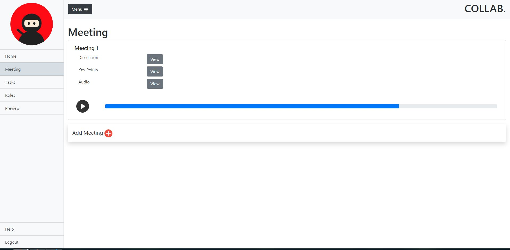
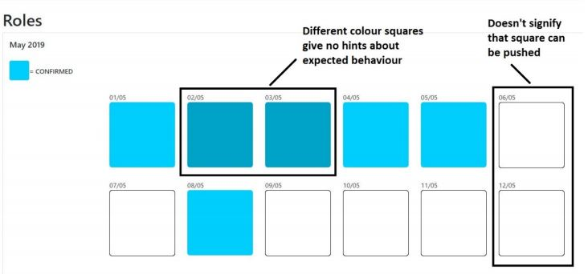
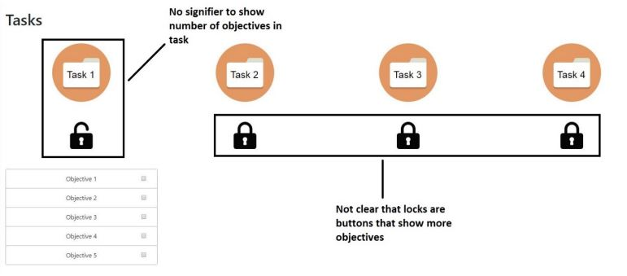

# Collab System

This is a university project which was created with the intention of conducting usability tests with users. I also conducted a heuristic analysis to try find problems with the system.

## Implementation

Collab system is a simple static site created with HTML, CSS, JQuery and Bootstrap.

## A few problems found via user testing

- Clicking on the squares on `Roles` page is confusing and the different colours are confusing.

- Users were confused about what items appeared under each task in the `Tasks` page.
- Icons were not clear on the `Tasks` page.

